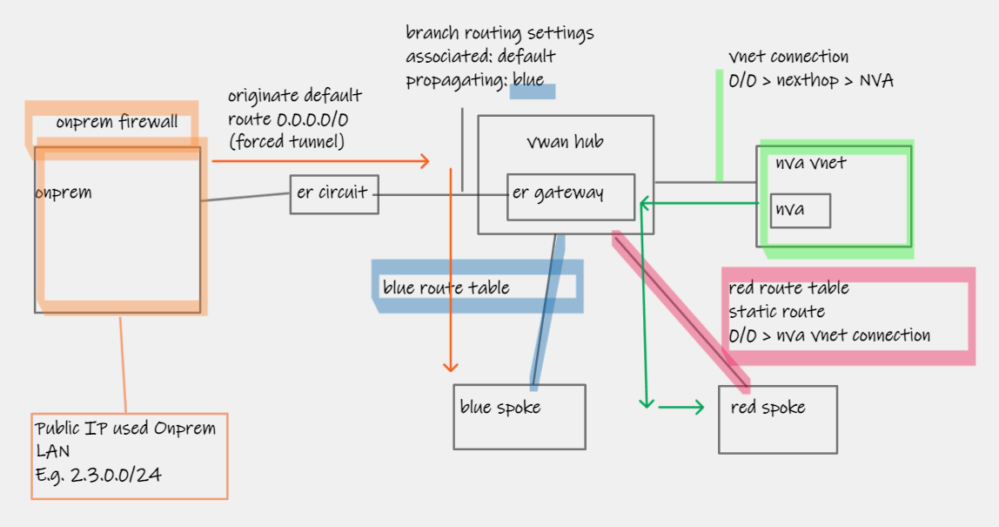
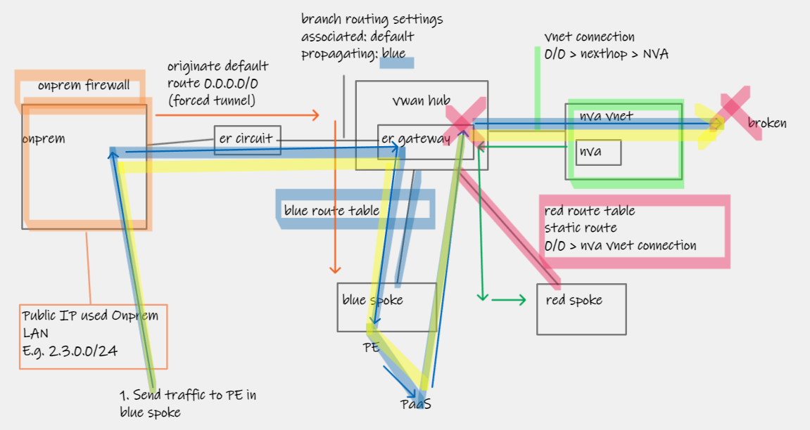
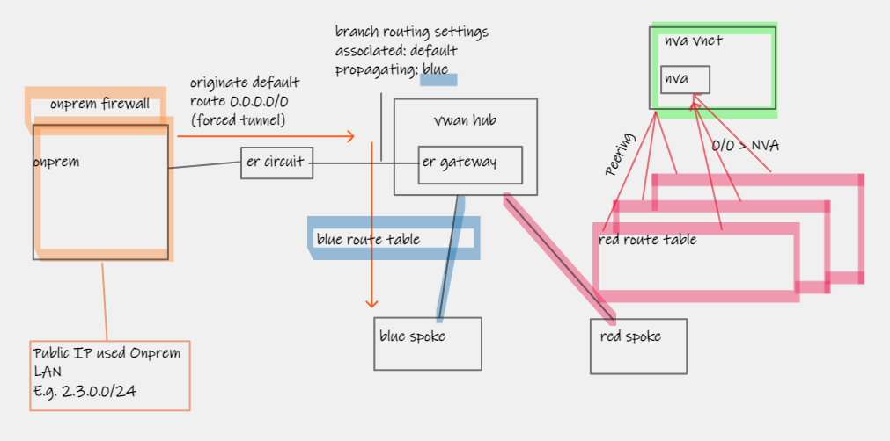

# Azure Virtual WAN default route scenarios

## Default route propagation between different Virtual WANs

Consider the following scenario:
- Two separate Azure Virtual WANs (**Hubs are in completed isolated parent level VWAN resources**)
- Both hubs are connected to the same ExpressRoute Circuit
- Hub [2] is originating a default route (via Azure Firewall to Internet, and Routing Intent enablement) and also propagating this route to ExpressRoute connection

Behaviour:
- MSEE (ER Circuit) learns, as expected, the default route, along with VWAN Hub (and any attached VNets) prefixes. These routes are then advertised to three onwards locations:
  - Onprem (via ER Private Peering)
  - VWAN Hub [1] via ER Connection
  - Regular "Normal" VNet/VNG via another Connection I have in place for testing
- :warning: The default route is installed in the routing table of the normal VNet, and On-Premises, but this is filtered out and not usable by Hub [1]

# Forced-tunnel and broken Private Link

Consider the following (Thankfully rare) scenario:

- Regular VWAN Hub (not secured hub)
- Blue custom route table
  - Branches propagate to blue, including a 0/0 adverting onprem>azure
  - blue spokes egress Internet via onprem
  - blue spokes also access public_IPs used at some on-prem branches (over 3000 prefixes, cannot send individual prefixes to Azure)
- Red custom route table
  - Branches to not propagate to red, red has 0/0 pointing to another spoke, containing NVA for DMZ internet egress
  - Red Spokes don't talk to onprem

All flows work correctly, except for On-Prem public_IP_addressed node talking to Private Endpoint in blue spoke.

Following diagram shows broken flow.Hub adjacency learnt 0/0 > NVA spoke is over-riding On-Prem learnt 0/0, and causing traffic to attempt to return via Green and get blackholed. 

> This only happens for Private Link traffic (not VM traffic) because of *waves hands* platform details.

The fix this customer went for is to breakout tbe Green NVA egress in to seperate "second hub" and remove the need for 0/0 static route in red_RT.

