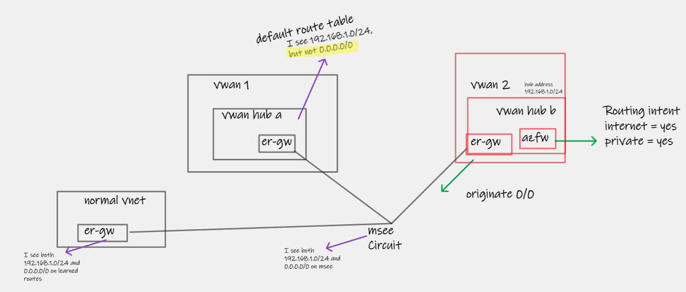

# Azure Virtual WAN default route scenarios

## Default route propagation between different Virtual WANs

Consider the following scenario:
- Two separate Azure Virtual WANs (**Hubs are in completed isolated parent level VWAN resources**)
- Both hubs are connected to the same ExpressRoute Circuit
- Hub [2] is originating a default route (via Azure Firewall to Internet, and Routing Intent enablement) and also propagating this route to ExpressRoute connection

Behaviour:
- MSEE (ER Circuit) learns, as expected, the default route, along with VWAN Hub (and any attached VNets) prefixes. These routes are then advertised to three onwards locations:
  - Onprem (via ER Private Peering)
  - VWAN Hub [1] via ER Connection
  - Regular "Normal" VNet/VNG via another Connection I have in place for testing
- :warning: The default route is installed in the routing table of the normal VNet, and On-Premises, but this is filtered out and not usable by Hub [1]

